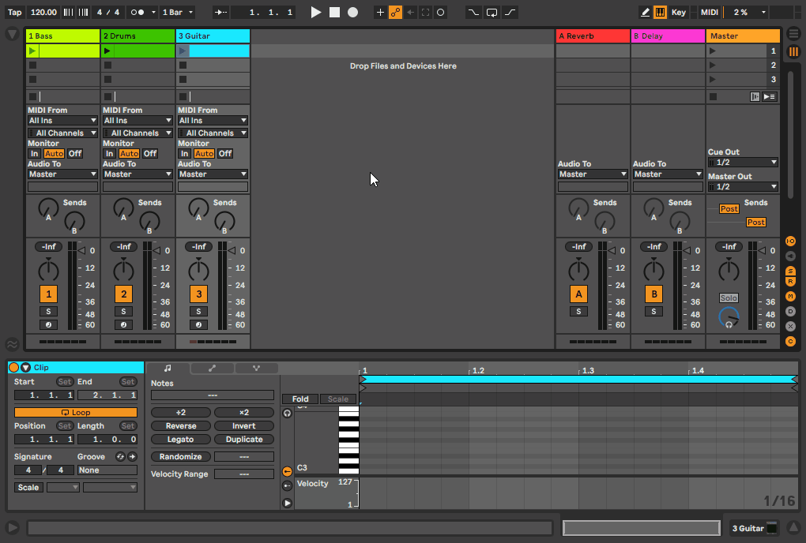
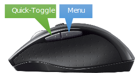
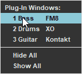

# plugin-window-helper

(PWH for short) 😀

An [AutoHotkey](https://www.autohotkey.com/) script for users of Ableton Live and Bitwig Studio. Get
instant access to your plug-in windows from anywhere in your DAW, and hide them when they're in the
way!

## Features

### Menu Hotkey

Click a hotkey to display a menu of plug-in windows, organized by track:

### Quick-Toggle Hotkey

Click to instantly hide all visible plug-in windows; a second click brings back just the windows
that were visible.

## Requirements

You need [AutoHotkey](https://www.autohotkey.com/download/) version 1.1.33 or later.

PWH has been tested with the following:

- Ableton Live versions 10 and 11
- Bitwig Studio version 4
- Windows 10

It should work with earlier versions as well - give it a try and let me know!

## Setup

Download
[plugin-window-helper.ahk](https://raw.githubusercontent.com/RandScullard/plugin-window-helper/master/plugin-window-helper.ahk)
from GitHub and save it somewhere reasonable on your PC. (If you're an AutoHotkey user, you probably
already have a folder where you keep your scripts.)

To give PWH a try, you can just double-click the `plugin-window-helper.ahk` file in the Windows File
Explorer. The AutoHotkey icon will appear in the system tray so you know it's running. If you like
it, you'll probably want to [make it start automatically with
Windows](https://www.autohotkey.com/docs/FAQ.htm#Startup).

### Advanced Setup

If you already have an AutoHotkey script with your favorite handy functions, simply
include PWH in the auto-execute section of your script and call the `PWHInit` function:

    #Include plugin-window-helper.ahk
    PWHInit()

PWH has been carefully crafted to **not** cause unwanted changes in your script - if you run into
any problems, please open an issue here on GitHub.

**Note:** You can customize PWH by passing parameters to the `PWHInit` function - see the
Customization section below.

## How To Use

PWH's hotkeys are assigned to the **mouse side buttons**:

&nbsp;&nbsp;&nbsp;&nbsp;&nbsp;&nbsp;

The hotkeys are also assigned to **touchpad gestures**:

- **Menu:** Three-finger tap
- **Quick-Toggle:** Four-finger tap

The Quick-Toggle hotkey is also assigned to the **Pause** key. (Not the ⏯️ key, but the old-school
Pause key, next to Scroll Lock on a standard desktop keyboard.)

**Note:** If you don't like these hotkey assignments, you can change them! See the Customization
section below.

### Using the Menu

In the menu, a normal click on an entry shows that window and hides all others. This is great when
you want to work with one plug-in at a time, but you can also **Ctrl+click** or **right-click** to
hide and show multiple windows (keeping the menu open):

&nbsp;&nbsp;&nbsp;&nbsp;&nbsp;&nbsp;

Hit Esc or click anywhere outside the menu to dismiss it.

**Time-Saving Tips** 

- Press and hold the mouse side button to open the menu, drag to the entry you want, and release the
    button - all in one smooth motion.
- When you have multiple plug-in windows open and you want one of the windows to be in front of the
     others, use Ctrl+click or right-click to **double-click** the window's menu entry. This will
     bring the window to the front.
- Another way to show a hidden window is to **double-click** your DAW's Open Plug-In Window button.
     Sometimes this is more convenient than using the PWH menu.

**Keep in Mind**

PWH can only hide and show plug-in windows that are already open. Unfortunately, it can't
open them for you! This means:

- Each time you open a project, you will need to manually open the plug-in windows you want to work
  with, just like you did before.
- Don't close plug-in windows - use PWH to hide them.

## Customization

Customize the behavior of PWH by passing parameters to the `PWHInit` function:

    PWHInit(AbletonTheme, MenuHotkeys, QuickToggleHotkeys)

- If you are running the PWH script standalone, edit `plugin-window-helper.ahk` and find the one and
  only call to `PWHInit` near the top of the file. Modify it to add parameters.
- If you've included PWH into your AutoHotkey script, then the call to `PWHInit` is in your script;
  add the parameters there.

**AbletonTheme**

If you're using Ableton Live, pass the name of your Live theme to make PWH's colors match:
`"Light"`, `"Mid Light"`, `"Mid Dark"`, `"Dark"`

The default value is `"Mid Light"`. Bitwig Studio does not support themes, so if you're using Bitwig
this parameter is ignored.

**MenuHotkeys, QuickToggleHotkeys**

To customize the hotkeys that will open the PWH menu and trigger the quick-toggle feature, use these
two parameters. Each one must be an array of strings where each string is the name of a
[hotkey](https://www.autohotkey.com/docs/Hotkeys.htm), including any modifier symbols.

The default values are:

- MenuHotkeys: `["#^+F22", "*XButton1"]`
- QuickToggleHotkeys: `["#^+F24", "*XButton2", "Pause"]`

Please note:

- Win+Ctrl+Shift+F22 is generated by Windows when you do a three-finger tap on the touchpad, and
  Win+Ctrl+Shift+F24 is generated for a four-finger tap.
- Mouse button hotkeys should include the `*` wildcard prefix so they will trigger even if any
  modifier keys (Ctrl, etc.) are held down.
- The topic of hotkeys can get pretty deep, and it goes way beyond the scope of this text. Please
  consult the [AutoHotkey documentation](https://www.autohotkey.com/docs/Hotkeys.htm) if you run
  into any trouble.

## License

MIT License

Copyright (c) 2021 Rand Scullard